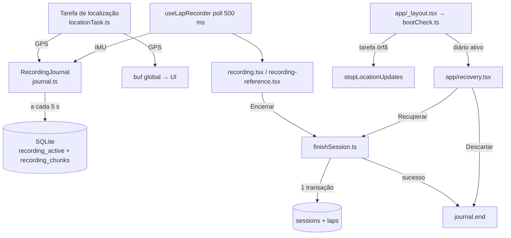

# Gravação sem perda — Design

**Spec**: `.specs/features/gravacao-sem-perda/spec.md`
**Status**: Approved (24/09)

---

## Abordagem

Há três formas de persistir os pontos durante a gravação. Todas atendem a mesma spec.

| | Abordagem | A favor | Contra |
|---|---|---|---|
| **A (recomendada)** | **Diário no SQLite.** Os pontos novos vão em pedaços para uma tabela própria a cada 5 s. É só append: cada escrita grava o que chegou desde a anterior | Custo constante por escrita. Usa o banco que já existe (WAL ligado). A recuperação e o salvamento final viram consultas simples | Duas tabelas novas. A escrita do diário concorre com a transação do "Encerrar" (ver Riscos) |
| B | **Snapshot JSON sobrescrito** a cada 10 s, como o `recovery.ts` da `fix/live-perf` | É o mais simples e o código já existe | Reescreve a sessão inteira a cada vez. Com IMU a 50 Hz, 15 min dão ~6 MB regravados a cada 10 s: custo que cresce com a sessão e pesa na bateria |
| C | **Arquivo NDJSON em append** pelo expo-file-system | É o append mais barato | Não confirmei na documentação se a API nova de `File` do SDK 54 faz append. Seria preciso ler e parsear na mão |

A `fix/live-perf` entra só como referência para o fluxo de UX da recuperação. O código
dela (a abordagem B) não entra.

---

## Architecture Overview



**Invariante central:** o diário só é apagado depois que a transação com a sessão e as
voltas faz commit. A sessão usa o id `session_<recordingId>`, e a gravação é
`INSERT` só se esse id ainda não existe. Assim, salvar duas vezes (crash entre o commit e a
limpeza, ou a recuperação interrompida) nunca duplica a sessão (REC-03).

---

## Code Reuse Analysis

### Existing Components to Leverage

| Component | Location | How to Use |
| --------- | -------- | ---------- |
| `detectLaps` | `src/lib/lapDetector.ts` | O mesmo detector do "Encerrar" roda sobre os pontos do diário na recuperação (REC-03) |
| Recorte de IMU por timestamp | `useLapRecorder.ts:759-768` | Vira `sliceLaps(samples, imu)` puro, usado pelo `stop()` e pela recuperação |
| Overlay in-app `idleOverlay`/`idleCard` | `app/recording.tsx:887-977` | Vira o componente `CockpitDialog`, que substitui todos os `Alert.alert` das duas telas |
| Pipeline pós-salvamento (XP, PB, conquistas, desafios) | `app/recording.tsx:447-586` | Sai da tela para `finishSession.ts`, e a recuperação reaproveita |
| Criação de layout de referência | `app/recording-reference.tsx:223-242` | Vira `saveReferenceLayout()` em `finishSession.ts`, e a recuperação de reconhecimento usa |
| Migrações por `PRAGMA user_version` | `src/storage/db.ts:136-201` | A v4 segue o padrão, mas dentro de transação |
| Runner de testes | `tsx` (já é devDependency) | `node --import tsx --test test/*.test.ts`, sem dependência nova (testado: no Node 20, passar só o diretório não acha `.ts`; o glob precisa vir do shell) |

### Integration Points

| System | Integration Method |
| ------ | ------------------ |
| expo-task-manager | `defineTask` sai do hook para `src/recording/locationTask.ts`, importado no topo de `app/_layout.tsx`. Assim a tarefa existe mesmo quando o sistema relança o app em segundo plano |
| expo-sqlite | `withExclusiveTransactionAsync` no salvamento da sessão (REC-05) e na migração v4; `PRAGMA busy_timeout` para o diário |
| expo-router | `gestureEnabled: false` nas duas telas (`_layout.tsx:151-152`); a rota nova `recovery`; o `AuthGate` passa pelo `bootCheck` antes de decidir a rota |
| BackHandler (RN) | Nas duas telas: o botão voltar do Android abre a confirmação |

---

## Components

### RecordingJournal
- **Purpose**: Acumular os pontos novos e gravá-los no armazenamento durável a cada 5 s, sem nunca travar a gravação.
- **Location**: `src/recording/journal.ts` (lógica pura, com o armazenamento injetado)
- **Interfaces**:
  - `begin(meta: RecordingMeta): Promise<string>`: cria o registro ativo e devolve o `recordingId`.
  - `appendGps(samples: GpsSample[]): void` e `appendImu(samples: ImuSample[]): void`: só acumulam em memória.
  - `flushIfDue(now: number): Promise<void>`: grava o pendente se já passou `FLUSH_INTERVAL_MS = 5000` desde a última escrita.
  - `flush(): Promise<void>`: grava o pendente imediatamente.
  - `end(recordingId: string): Promise<void>`: apaga o registro ativo e os pedaços.
  - `get failed(): boolean`: fica verdadeiro se a última escrita falhou; alimenta o aviso do HUD (REC-10).
- **Dependencies**: `JournalStore` (interface), relógio injetado.
- **Reuses**: tipos `GpsSample` e `ImuSample` de `src/lib/geometry.ts`.
- **Regra de falha**: se a escrita falha, o pendente **não** é descartado. Ele entra de novo na próxima tentativa, e a gravação em memória segue intacta.

### SqliteJournalStore
- **Purpose**: Implementar o `JournalStore` sobre o SQLite.
- **Location**: `src/storage/journalStore.ts`
- **Interfaces**: `createActive(meta)`, `appendChunk(id, seq, gps, imu)`, `readActive(): ActiveRecording | null`, `readChunks(id)`, `deleteRecording(id)`.
- **Dependencies**: `db()` de `src/storage/db.ts`.

### Location task
- **Purpose**: Receber o GPS em segundo plano, aplicar o filtro de porta (30 m) e o timestamp, e entregar ao `buf` da UI e ao diário.
- **Location**: `src/recording/locationTask.ts` (sai de `useLapRecorder.ts:11-68`)
- **Regra**: se o callback roda e não há gravação ativa no diário, a tarefa para a si mesma (REC-09). Com diário ativo, os pontos entram no diário mesmo com a UI morta, o que cobre o relançamento do app em segundo plano.

### bootCheck
- **Purpose**: Na abertura, parar a tarefa órfã e descobrir se há gravação interrompida (REC-09, REC-02).
- **Location**: `src/recording/bootCheck.ts`
- **Interfaces**: `runBootCheck(deps): Promise<BootResult>`, em que `BootResult = { kind: 'none' } | { kind: 'already-saved' } | { kind: 'interrupted', summary } | { kind: 'unreadable' }`.
- **Regra**: na abertura do processo nenhuma tela de gravação está montada, então todo diário ativo é uma gravação interrompida. Se `session_<recordingId>` já existe, o crash foi entre o commit e a limpeza: o `bootCheck` apaga o diário em silêncio e devolve `already-saved`.

### Recovery (lógica)
- **Purpose**: Montar o resumo (pista, início, voltas completas) e executar "Recuperar" ou "Descartar".
- **Location**: `src/recording/recovery.ts` (puro, com dependências injetadas)
- **Interfaces**:
  - `summarize(active, chunks): RecoverySummary | 'unreadable'`
  - `recover(recordingId, deps): Promise<{ sessionId } | { layoutId }>`
  - `discard(recordingId, deps): Promise<void>`
- **Regras**:
  - Um formato com `version` diferente de 1 ou com JSON inválido dá `unreadable` (REC-02, AC 7).
  - Zero voltas dá `laps: 0`, e a tela oferece só "Descartar" (AC 6).
  - Reconhecimento vira layout de referência (edge case). Corrida vira sessão com `recovered = 1`.

### RecoveryScreen
- **Purpose**: A tela de recuperação, em retrato, antes da home.
- **Location**: `app/recovery.tsx`
- **Conteúdo**: pista, horário de início, número de voltas completas, "Recuperar" e "Descartar", mais as mensagens de "sem volta" e "não consegui ler".

### finishSession
- **Purpose**: O caminho único para transformar pontos em sessão salva, usado pelo "Encerrar", pela confirmação de saída e pela recuperação.
- **Location**: `src/recording/finishSession.ts`
- **Interfaces**:
  - `sliceLaps(samples, imu): RecordedLap[]`, puro.
  - `saveRecordedSession(input): Promise<Session>`: sessão e voltas numa transação exclusiva, com `INSERT` só se o id não existe (REC-05).
  - `saveReferenceLayout(input): Promise<TrackLayout>`
  - `runPostSaveEffects(session, laps, opts)`: XP, PB, conquistas e desafios, que já existiam. Com `opts.fromRecovery`, pula o insight de IA e a publicação no leaderboard.

### Exit guard e CockpitDialog
- **Purpose**: Confirmar a saída da gravação e mostrar qualquer diálogo nas telas em paisagem sem `Alert.alert` (REC-07, REC-08).
- **Location**:
  - `src/recording/exitGuard.ts`: redutor puro. Os estados são `idle | confirming`, e as ações são `requestExit`, `continue`, `finish` e `discard`.
  - `src/components/CockpitDialog.tsx`: título, texto e até 3 botões, com o estilo do `idleCard`.
- **Uso**: `BackHandler` (Android) e o botão de cancelar disparam `requestExit`. O gesto do iOS fica desligado no `Stack.Screen`.

### Mudanças nas telas e no hook
- **`useLapRecorder.ts`**:
  - o `start()` recebe `meta` e chama `journal.begin`;
  - o poll entrega a IMU ao diário e chama `flushIfDue`;
  - `info.autosaveFailed` passa a vir de `journal.failed`;
  - se o `start()` falha, ele solta o keep-awake, volta a `idle` e lança o erro com a mensagem da spec (REC-10).
- **`recording.tsx`**:
  - `doFinish` chama `finishSession` dentro de try/catch; se falha, abre o `CockpitDialog` com a mensagem de REC-05, AC 2, e "OK" leva para `/`;
  - os 4 `Alert.alert` viram `CockpitDialog`;
  - o botão de cancelar passa pelo exit guard.
- **`recording-reference.tsx`**:
  - os 6 `Alert.alert` viram `CockpitDialog`;
  - a meta atingida vira faixa na tela, sem toque (REC-08, AC 2);
  - a transição para `/recording` passa o `layoutId` recém-criado (REC-11).
- **`preflight.tsx:62-63`**: passa `undefined` em vez de `''`, e o `recording.tsx` normaliza `'' → null` (REC-12).
- **Histórico e análise**: selo "Recuperada" quando `session.recovered` (REC-03, AC 4).
- **`new-session` / at-track**: antes de iniciar, se houver diário ativo, leva para `/recovery` (REC-13).

---

## Data Models

```typescript
// Diário: formato versionado
type RecordingMeta = {
  version: 1;
  recordingId: string;          // rec_<ts>_<rand>
  mode: 'race' | 'reference';
  startedAt: number;
  trackId: string | null;
  trackName: string;
  layoutId: string | null;      // race
  layoutName: string | null;    // reference
  kartSetupId: string | null;
};
```

```sql
-- migração v4 (dentro de withExclusiveTransactionAsync)
CREATE TABLE IF NOT EXISTS recording_active (
  id TEXT PRIMARY KEY,
  meta_json TEXT NOT NULL,
  started_at INTEGER NOT NULL
);
CREATE TABLE IF NOT EXISTS recording_chunks (
  recording_id TEXT NOT NULL,
  seq INTEGER NOT NULL,
  gps_json TEXT NOT NULL,
  imu_json TEXT NOT NULL,
  PRIMARY KEY (recording_id, seq)
);
ALTER TABLE sessions ADD COLUMN recovered INTEGER NOT NULL DEFAULT 0;
UPDATE sessions   SET layout_id = NULL     WHERE layout_id = '';
UPDATE sessions   SET kart_setup_id = NULL WHERE kart_setup_id = '';
UPDATE pb_records SET layout_id = NULL     WHERE layout_id = '';
PRAGMA user_version = 4;
```

O `Session` ganha o campo `recovered: boolean`. Uma sessão nova recebe o id
`session_<recordingId>`; as antigas mantêm o formato atual.

---

## Error Handling Strategy

| Error Scenario | Handling | User Impact |
| -------------- | -------- | ----------- |
| Escrita do diário falha (disco cheio, `SQLITE_BUSY`) | O pendente é mantido e tentado de novo no próximo flush; `failed = true` | Faixa no HUD "Salvamento automático falhou"; a gravação segue |
| Transação do "Encerrar" falha | Rollback e o diário continua ativo | Diálogo "Não consegui salvar a sessão…"; "OK" leva para a home, e a recuperação aparece na próxima abertura |
| Crash entre o commit e o `journal.end` | O `bootCheck` vê `session_<rid>` existente e limpa em silêncio | Nenhum |
| Crash durante "Recuperar" | É a mesma transação idempotente | A recuperação é oferecida de novo; não sai sessão duplicada |
| `start()` do GPS falha | Solta o keep-awake e volta para `idle`; o `journal.end` descarta o diário vazio | "Não consegui ligar o GPS. Confira a permissão de localização e tente de novo." |
| Diário com versão desconhecida ou JSON quebrado | `summarize` devolve `unreadable` | "Não consegui ler a gravação interrompida"; o diário é apagado |
| Callback da tarefa sem diário ativo | A tarefa se para | Some a notificação de gravação solta |

---

## Risks & Concerns

| Concern | Location (file:line) | Impact | Mitigation |
| ------- | -------------------- | ------ | ---------- |
| A tela de gravação tem 2001 linhas, com o pipeline de salvamento embutido | `app/recording.tsx:417-600` | Mexer em cima do que existe quebra fácil | O pipeline sai para `finishSession.ts`, e a tela só chama |
| Timers de JS em segundo plano no iOS | `useLapRecorder.ts:441` | Se o `setInterval` for suspenso com a tela apagada, o flush da IMU para | O GPS vai ao diário direto do callback da tarefa, que roda em segundo plano. A IMU já não é capturada em segundo plano hoje (`:431-434`). **Não confirmei** o comportamento exato dos timers no iOS em segundo plano |
| Diário concorrendo com a transação exclusiva | `db.ts`, novo | Um `SQLITE_BUSY` no diário durante o "Encerrar" | `PRAGMA busy_timeout = 2000`. O diário é best-effort e tenta de novo; o `stop()` faz o flush final **antes** de abrir a transação |
| Corrida na inicialização do banco | `src/storage/db.ts:9-10` | Uma chamada simultânea recebe o banco sem as tabelas | `db()` passa a memoizar a **promise** da inicialização (REC-06) |
| Migrações fora de transação | `src/storage/db.ts:136-201` | Um crash no meio deixa o schema pela metade | A v4 roda inteira em transação. As v1–v3 continuam como estão, porque já rodaram nos aparelhos |
| O app não tem runner de testes de React Native | `package.json` | Não dá para testar em Node o `BackHandler`, o gesto e a tela de recuperação | A lógica fica em módulos puros testados (`journal`, `recovery`, `exitGuard`, `finishSession`, `bootCheck`). Há um teste estático para a ausência de `Alert.alert` e para o `gestureEnabled: false`. A fiação da UI é verificada num dev build no aparelho da Julia (roteiro de UAT em `tasks.md`) |
| O Mac não roda simulador iOS e o build nativo trava a máquina | ambiente | Não há verificação visual local | Gate local: `tsc` + `npm test`. A verificação visual fica no aparelho, por EAS |
| O `defineTask` no módulo do hook só existe se a tela de gravação foi importada | `useLapRecorder.ts:25` | No relançamento em segundo plano, a tarefa pode não estar definida | A tarefa passa a ser importada no topo de `app/_layout.tsx` |

---

## Tech Decisions

| Decision | Choice | Rationale |
| -------- | ------ | --------- |
| Onde persistir | Diário no SQLite, com flush a cada 5 s | O custo é constante. 5 s de flush mais 0,5 s de poll ficam dentro da meta de 10 s |
| Id da sessão | `session_<recordingId>` | É o que torna salvar e recuperar idempotentes |
| Efeitos de uma sessão recuperada | XP, PB, conquistas e desafios sim; IA e leaderboard não | A IA gasta a chave do usuário fora de contexto, e o leaderboard vai ser refeito em `nuvem-segura` |
| Runner de testes | `node:test` + `tsx` (`npm test`) | Não precisa de dependência nova, e o `tsx` já roda o `lapDetector` hoje. Jest com preset do RN fica para quando houver teste de componente |
| O que fazer com o `recovery.ts` da `fix/live-perf` | Não portar o código; reaproveitar o fluxo de UX | Snapshot sobrescrito não escala com a IMU a 50 Hz |

Não há decisão nova de nível de projeto: tudo aqui é local desta feature. O runner de
testes pode virar convenção do projeto, e ele entra no `STATE.md` se a próxima feature
confirmar o uso.
