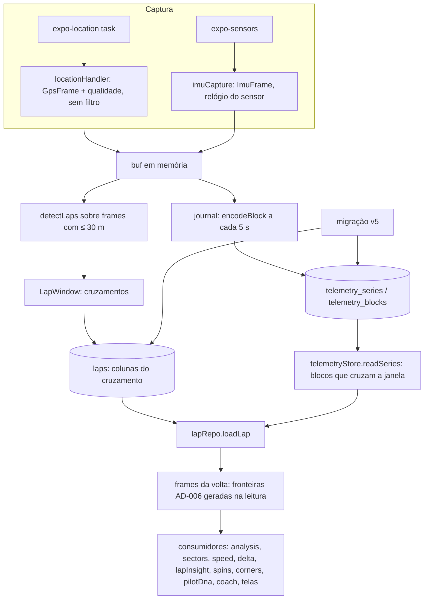

# Telemetry frame Design

**Spec**: `.specs/features/telemetry-frame/spec.md`
**Context**: `.specs/features/telemetry-frame/context.md`
**Status**: Approved (06/10)

---

## Architecture Overview

São três formas para o mesmo dado, e cada uma tem um único dono:

| Forma | Onde vive | Quem usa |
|---|---|---|
| **Bloco binário** (BLOB colunar em Float64) | SQLite: `telemetry_series` + `telemetry_blocks` | Só o `telemetryStore` e o codec |
| **Série colunar** (`GpsSeries`, `ImuSeries`, `ChannelSeries`: arrays tipados) | Memória: o bruto da sessão inteira | Diário, recuperação, migração, detecção de voltas na gravação, contrato multi-fonte |
| **Frame** (`GpsFrame`, `ImuFrame`, `ChannelFrame`: objetos) | Memória: só a janela pedida (uma volta, um traçado) | Todos os consumidores: análise, setores, delta, coach, mapa, replay, telas |

Escolhida pela Julia em 06/10: blocos binários no banco, com séries colunares e objetos na memória.
O bruto de 20 min (cerca de 72 mil amostras) nunca vira 72 mil objetos. Uma volta (cerca de 500 de
GPS e 2.500 de IMU) vira objetos, e os laços de análise mantêm a forma de hoje.



---

## Code Reuse Analysis

### Existing Components to Leverage

| Component | Location | How to Use |
| --------- | -------- | ---------- |
| Resolução do timestamp do GPS (`trustsRaw`, `lastT`, espalhamento de 100 ms) | `src/recording/locationHandler.ts:54-67` | Mantida. Passa a marcar `timeRepaired` quando usa o tempo estimado, e o resultado vira `t − t0Utc` |
| Diário (`flushIfDue`, fila pendente, `failed`) | `src/recording/journal.ts` | Mesma cadência de 5 s e mesma regra de falha. O pedaço JSON vira um bloco binário por série, gravado na mesma transação |
| `detectLaps`, `crossing`, `lineFromLayout`, `lineFromMotion` | `src/lib/lapDetector.ts`, `src/lib/startLine.ts` | Mesmos algoritmos, com o tipo trocado para `GpsFrame` |
| `boundaryPoint` / `sliceLaps` | `src/recording/finishSession.ts:26-55` | A regra vira `lapFrames(window, series)` e roda na leitura. A precisão do ponto de fronteira (a pior do par) fica guardada no cruzamento |
| `cleanSamples`, `repairDegenerateTimestamps` | `src/lib/analysis.ts:307,333` | Mesmas regras sobre `GpsFrame`. Cada consumidor mantém exatamente o caminho de limpeza que tem hoje (ver Risks) |
| `MigrationExecutor` injetável | `src/storage/migrations.ts:7-15` | A v5 segue o padrão da v4 |
| Repositórios injetados + fakes | `finishSession.ts:76-141`, `test/helpers/fakeSessionRepo.ts` | `TelemetryStore` e `LapRepo` são interfaces, com implementação SQLite e implementação sobre sql.js nos testes |
| Pistas sintéticas | `test/helpers/syntheticTrack.ts` | Base das sessões de referência |
| `DEMO_LAP` (bench de 3 voltas, 5 Hz) | `src/data/demoLap.ts` | Segunda sessão de referência |
| Leitor do spike | `Copilot-kart-dados/xrk/spike/xrk.ts` | Não entra no app agora. As séries foram desenhadas para receber o que ele devolve (`t[]`, `v[]` por canal) |

### Integration Points

| System | Integration Method |
| ------ | ------------------ |
| SQLite (`kartlap.db`) | Migração v5: tabelas novas, colunas de janela em `laps` e `track_layouts`, e conversão de tudo o que hoje está em JSON |
| Ao vivo (`live_samples`) | `toLiveSample(frame, info)` monta o mesmo payload de hoje a partir de um `GpsFrame` |
| Conta-e-backup (feature 4) | Vai subir os blocos de `telemetry_blocks` como estão, já em formato binário e em blocos |
| Importar `.xrk` (feature 7) | Um adaptador transforma a saída do leitor em `ChannelSeries`/`GpsSeries` com fonte `MYCHRON` e grava pelo mesmo `telemetryStore` |

---

## Components

### 1. Modelo (`src/telemetry/frame.ts`)

- **Purpose**: tipos de frame e de série, catálogo de unidades e fontes.
- **Location**: `src/telemetry/frame.ts`
- **Interfaces**: os tipos da seção Data Models, mais:
  - `assertUnit(channel: string, unit: string): Unit`: lança `UnitError` com o canal e a unidade quando a unidade está fora do catálogo (TF-21).
  - `G = 9.80665`: conversão do acelerômetro, que entrega em g, para m/s².
- **Dependencies**: nenhuma.
- **Reuses**: `CrossPoint` de `startLine.ts`.

### 2. Codec de bloco (`src/telemetry/blockCodec.ts`)

- **Purpose**: série colunar ↔ BLOB, sem perda.
- **Interfaces**:
  - `encodeBlock(series: Series, from: number, to: number): Uint8Array`
  - `decodeBlock(kind: SeriesKind, payload: Uint8Array): Series`
  - `concatSeries(parts: Series[]): Series`
- **Formato** (little-endian):
  - cabeçalho: `version u8 = 1`, `kind u8`, `n u32` e `mask u16` (quais colunas estão presentes);
  - depois, as colunas Float64 presentes em ordem fixa e as colunas `u8` (`fix`, `flags`).
  - Coluna inteira ausente (só NaN) não é gravada. O valor ausente dentro de uma coluna presente é NaN.
- **Alinhamento**: o BLOB que o SQLite devolve pode não estar alinhado em 8 bytes. A decodificação copia
  o trecho (`slice`) antes de criar o `Float64Array`.
- **Tamanho**: GPS com 9 colunas Float64 e 2 colunas `u8` dá cerca de 74 B por amostra. IMU com 7
  colunas Float64 dá 56 B. Para 20 min a 10 Hz e 50 Hz: 0,89 MB + 3,36 MB = **cerca de 4,3 MB**, dentro
  dos 5 MB (TF-10).
  - Float64 em tudo é o que garante a ida e volta exata exigida por TF-14 e TF-22.
  - Float32 economizaria 40%, mas mudaria os números.

### 3. Armazenamento (`src/telemetry/telemetryStore.ts`)

- **Purpose**: o único código que lê e grava `telemetry_series` e `telemetry_blocks`.
- **Interfaces**:
  - `createSeries(conn, meta: SeriesMeta): Promise<void>`
  - `appendBlocks(conn, blocks: {seriesId, seq, payload, n, tFirst, tLast}[]): Promise<void>`: numa transação só (GPS e IMU do mesmo flush entram juntos).
  - `readSeries(conn, owner: Owner, opts?: {kinds?: SeriesKind[]; tFrom?: number; tTo?: number}): Promise<Series[]>`: com janela, lê só os blocos cuja faixa `[t_first, t_last]` cruza a janela.
  - `deleteOwner(conn, owner: Owner): Promise<void>`: dentro da transação de quem chama.
- **Dependencies**: `SqlConn`, um recorte do expo-sqlite (`runAsync`, `getAllAsync`, `execAsync`,
  `withExclusiveTransactionAsync`), e o codec.
- **Reuses**: o padrão de repositório injetado.

### 4. Captura (`src/recording/locationHandler.ts`, `src/recording/imuCapture.ts`, `src/recording/sessionClock.ts`)

- **Purpose**: transformar o que o sistema entrega em frames, no relógio da sessão.
- **Interfaces**:
  - `createSessionClock(t0Utc: number)`:
    - `gpsT(resolvedEpochMs: number): number`
    - `imuT(sensorSeconds: number, nowMs: number): number`
  - `handleLocations(locations, deps): GpsFrame[]`. **Sem o corte de 30 m** (TF-03).
    - A precisão ausente fica `undefined`, e não mais 999.
    - Marca `timeRepaired` quando o tempo foi estimado (TF-04).
    - Guarda `gnssTime = loc.timestamp`, o horário bruto da fix.
  - `imuCapture.onAccel/onGyro(event)`. Pareia os dois sensores como hoje:
    - o frame sai quando os dois chegaram, com `t` do mais recente;
    - se o mesmo sensor chega duas vezes antes de o par fechar, sai um frame só com ele (edge case da spec);
    - o acelerômetro é convertido de g para m/s².
- **Relógio**:
  - `t0Utc` é o `startedAt` do `journal.begin`.
  - GPS: `t = resolvedEpochMs − t0Utc`, com o `max(t, lastT + 1)` de hoje.
  - IMU: `offset = nowMs − sensorSeconds·1000`, fixado no primeiro evento da sessão. Daí em diante,
    `t = sensorSeconds·1000 + offset − t0Utc`, com `max(t, lastT + 1)`. O relógio do sensor conta desde
    o boot e só anda para frente (Android `SensorEvent.timestamp` em ns; iOS `CMLogItem.timestamp` em s).
    Por isso o espaçamento entre leituras é o real, e não o `Date.now()` do pareamento (TF-05, TF-06).
- **Dependencies**: `TelemetryFrame`.
- **Reuses**: a lógica de `locationHandler.ts:54-67` e o pareamento de `useLapRecorder.ts:53-81`, que sai do hook e vai para um módulo puro e testável.

### 5. Diário e recuperação (`src/recording/journal.ts`, `src/recording/recovery.ts`, `src/recording/bootCheck.ts`)

- **Purpose**: gravar o bruto em blocos enquanto a gravação acontece, e esse bruto já é o da sessão.
- **Mudanças**:
  - `begin(meta)` cria as séries `gps` e `imu` com dono `session:session_<recordingId>`, fonte `PHONE` e `t0Utc`. Também grava `recording_active`, como hoje.
  - `flush` codifica o pendente em um bloco por série e chama `appendBlocks`. A regra de falha e de nova tentativa continua a mesma.
  - `end(id)` apaga só `recording_active`. **As séries ficam**: elas são a sessão (TF-07).
  - `discard(id)` apaga `recording_active` e as séries (`deleteOwner`). É o caminho de descarte, que hoje usa o `end`.
  - `recover` lê as séries (`readSeries`), detecta as voltas e salva a sessão sem copiar frames (TF-08 e o edge da sessão recuperada).
  - `bootCheck` com a sessão já salva só apaga `recording_active`. Hoje ele apaga o diário inteiro.
- **Reuses**: tudo da `gravacao-sem-perda`, só com outro formato no armazenamento.

### 6. Voltas (`src/telemetry/laps.ts`, `src/storage/lapRepo.ts`)

- **Purpose**: volta = janela sobre o bruto (TF-11).
- **Interfaces**:
  - `sliceLapWindows(gps: GpsFrame[], line?): LapWindowRecord[]`: troca o `sliceLaps`. Roda `detectLaps` sobre os frames com precisão definida e ≤ 30 m (`analysisGps`, TF-12) e guarda cada cruzamento com a precisão do ponto de fronteira (a regra de `boundaryPoint`).
  - `lapFrames(window, gps: GpsSeries, imu?: ImuSeries): {gps: GpsFrame[]; imu: ImuFrame[]}`:
    - para janela por cruzamento: `[fronteira(start), frames com ≤ 30 m e start.t < t < end.t, fronteira(end)]`. A IMU entra em `start.t ≤ t ≤ end.t`, como hoje;
    - para janela por índice (legado): os frames `from..to` como estão.
  - `lapRepo.loadLaps(sessionId, opts?: {imu?: boolean}): Promise<LapRecord[]>`: um `readSeries` por sessão, com a janela que cobre todas as voltas, e `lapFrames` por volta. A IMU só é lida quando pedida.
  - `lapRepo.loadLapSummaries(sessionId)`: id, `startedAt` e `durationMs`, sem tocar no bruto. É para `recap`, `gamification`, `challenges` e as listas, que hoje leem o JSON inteiro só para pegar a duração.
- **Reuses**: `boundaryPoint` e o recorte de `sliceLaps`, movidos para cá.

### 7. Traçados (`src/storage/layoutRepo.ts`)

- **Purpose**: o traçado tem frames próprios, com dono `layout:<id>`, e uma janela igual à da volta (TF-19).
- **Mudanças**:
  - `saveReferenceLayout` e `nextReferenceLayout` copiam a série da janela da volta para o dono do traçado.
  - `rowToLayout` passa a ler as séries. `lineFromLayout` continua recebendo `frames[0]` = fronteira de início. A ordem e a marca `synthetic` ficam as mesmas.
  - `listAllLayoutsGrouped`, usado pelas silhuetas, lê só a série GPS do traçado.
- `track_references` (legado, ainda lido pela silhueta em `TrackShape.tsx:29`) vira dono
  `reference:<track_id>`. Assim nenhum JSON de amostra sobra no código.

### 8. Migração v5 (`src/storage/migrations.ts`, `src/telemetry/legacy.ts`)

- **Purpose**: converter tudo o que está em JSON (TF-17 a TF-20).
- **Conversão** (`legacy.ts`, puro e testável sem banco):
  - **`convertSessionLaps(laps: LegacyLapRow[]): {gps, imu, windows, skipped}`**
    1. Ordena as voltas por `started_at` e escolhe `t0Utc` = o menor `t` da sessão.
    2. Para cada volta:
       - remove os pontos `synthetic` das pontas e os transforma nos cruzamentos `start`/`end`;
       - se a volta não tem ponto sintético (anterior à AD-006), a janela é por índice;
       - se a 1ª amostra é idêntica (`t`, `lat` e `lng`) à última da volta anterior, ela é descartada (TF-17 AC 3);
       - todos os frames recebem `legacy` e `fix: unknown`.
    3. Um JSON ilegível vai para `skipped`: a volta mantém tempo e `started_at`, fica sem janela, e a conversão segue (TF-20 AC 8).
  - **`convertLayout(row)`**: a mesma regra, sobre uma volta só.
  - **`convertJournal(chunks)`**: um diário v4 pendente vira séries. Isso cobre quem atualiza o app com uma recuperação ainda pendente.
- **Execução**, ver a decisão "Migração em etapas":
  - **v5a**: numa transação, cria as tabelas, as colunas de janela e `sessions.frames_version`.
  - **v5b**: uma transação exclusiva por sessão e por traçado. Converte, grava as séries, preenche as janelas e marca `frames_version = 5`.
    - Se uma sessão falha, só ela é desfeita. A próxima abertura continua da primeira sessão sem a marca.
  - **v5c**: com tudo convertido, numa transação, remove `laps.samples_json`, `laps.imu_samples_json`, `track_layouts.samples_json`, `track_references.samples_json` e `recording_chunks`, e grava `user_version = 5`.
    - A remoção usa `ALTER TABLE … DROP COLUMN`. A tabela é reconstruída quando a coluna é `NOT NULL` com dado.
- **Reuses**: `MigrationExecutor`.

### 9. Consumidores reescritos sobre frames

- **Purpose**: TF-13 e TF-14. Todo arquivo da tabela "Consumidores" (Data Models) troca `GpsSample`/`ImuSample`/`LocalSample` por `GpsFrame`/`ImuFrame`/`LocalGpsFrame`, e `LapRecord.samples`/`imuSamples` por `LapRecord.gps`/`imu`.
- A regra é **mesma estrutura, outro tipo**. Nenhum algoritmo muda, e cada caminho de limpeza continua como está, inclusive as inconsistências registradas em Risks: elas são corrigidas depois, em outra feature, com os números mudando de propósito.
- **Três cálculos que hoje estão dentro de telas viram funções puras** antes da reescrita, para entrarem na comparação de referência:
  - o ponto de frenagem B (`app/session/[id].tsx:1345`);
  - a velocidade mínima por curva (`app/track-map.tsx:~150`);
  - os percentis 5/95 da cor (`app/session/[id].tsx:1256`).

### 10. Comparação de referência (`test/golden/`, `scripts/golden-capture.ts`)

- **Purpose**: provar TF-14 número a número.
- **Sessões de referência** (`test/golden/sessions.ts`):
  1. Pista circular a 10 Hz, base epoch 1,79e12. Tem paddock, volta de saída, 6 voltas e box, fixes acima de 30 m, um trecho com timestamp quantizado e IMU a 50 Hz com um trompo.
  2. O `DEMO_LAP` a 5 Hz em 3 voltas, com precisão variando entre 3 e 12 m.
  3. Um traçado a partir da melhor volta da sessão 1.
  4. Uma volta legada com timestamps degenerados, para exercitar `repairDegenerateTimestamps`.
- **Captura (tarefa 1, antes de qualquer mudança)**: `scripts/golden-capture.ts` roda o pipeline **atual** sobre cada sessão e grava `test/golden/expected.json`.
  - O pipeline: `handleLocations`, `sliceLaps`, `LapRecord` e todos os consumidores puros, mais as três funções extraídas e o payload do ao vivo.
- **Teste**: `golden.test.ts` roda o pipeline **novo** sobre as mesmas entradas brutas e compara pela regra de tolerância.
  - O pipeline novo: frames, séries, codec e banco sql.js, depois janelas, `lapFrames` e os consumidores.
  - Roda também pelo caminho legado: o JSON antigo passa pela conversão da v5, depois pelos consumidores.
- **Tolerância** (aprovada pela Julia em 06/10):
  - inteiros e strings: iguais;
  - grandezas de tempo: até 0,001 ms;
  - as demais grandezas reais: até 1e-9.
  - O tempo muda porque `t` desde o início da sessão é mais preciso que epoch em ms: o double perde cerca de 0,00024 ms perto de 1,8e12.

### 11. Selo (`src/telemetry/badge.ts` + `app/session/[id].tsx`)

- **Interfaces**: `sessionBadge(source: Source, lapsGps: GpsFrame[][], allGps: GpsFrame[]): {sourceLabel: 'Celular' | 'MyChron'; quality: 'boa' | 'média' | 'ruim' | 'desconhecida'; medianAccuracyM: number | null}`.
  - A mediana é calculada sobre os frames das voltas, sem os pontos de fronteira.
  - Sem volta, usa todos os frames da sessão (TF-24 AC 4).
  - Faixas: ≤ 5 m, ≤ 10 m e > 10 m.
  - Fontes `ALFANO` e `GOPRO` ainda não têm rótulo, porque nenhuma é gravada nesta feature.
- **UI**: uma linha no cabeçalho da tela da sessão, no formato **"Celular · GPS boa (4 m)"**. Para "desconhecida", não mostra metros. Usa os tokens de texto secundário do tema, sem componente novo.

---

## Data Models

```typescript
// src/telemetry/frame.ts
export type Source = 'PHONE' | 'MYCHRON' | 'ALFANO' | 'GOPRO';
export type FixState = 'none' | '2d' | '3d' | 'unknown';
/**
 * Catálogo fechado. Usa SI, mais rpm e °C. Há duas exceções: `deg`, porque lat/lng, rumo e
 * direção são graus em todo o app, e `%`, para pedal e borboleta.
 */
export type Unit = 'deg' | 'm' | 'm/s' | 'm/s²' | 'rad/s' | 'Pa' | 'V' | 'A' | '°C' | 'rpm' | '%' | 'ms' | '1';

export type GpsFrame = {
  kind: 'gps';
  source: Source;
  t: number;                 // ms desde t0Utc da série
  lat: number; lng: number;  // deg
  speed: number;             // m/s
  heading?: number;          // deg, 0 = norte
  altitude?: number;         // m
  accuracy?: number;         // m (horizontal)
  altitudeAccuracy?: number; // m
  fix: FixState;
  gnssTime?: number;         // epoch ms da fix, como o sistema entregou
  timeRepaired?: true;
  legacy?: true;
  synthetic?: true;          // só nos pontos de fronteira gerados na leitura (AD-006); nunca gravado
};
export type LocalGpsFrame = GpsFrame & { x: number; y: number };

export type Vec3 = { x: number; y: number; z: number };
export type ImuFrame = {
  kind: 'imu';
  source: Source;
  t: number;
  accel?: Vec3; // m/s²
  gyro?: Vec3;  // rad/s
  legacy?: true;
};

export type ChannelFrame = { kind: 'channel'; source: Source; channel: string; unit: Unit; t: number; value: number };
export type TelemetryFrame = GpsFrame | ImuFrame | ChannelFrame;

// Séries colunares: NaN = ausente
export type SeriesKind = 'gps' | 'imu' | 'channel';
export type Owner = { kind: 'session' | 'layout' | 'reference'; id: string };
export type SeriesMeta = {
  id: string; owner: Owner; source: Source; kind: SeriesKind;
  channel?: string; unit?: Unit; t0Utc: number | null; legacy: boolean;
};
export type GpsSeries = {
  meta: SeriesMeta; n: number;
  t: Float64Array; lat: Float64Array; lng: Float64Array; speed: Float64Array;
  heading: Float64Array; altitude: Float64Array; accuracy: Float64Array;
  altitudeAccuracy: Float64Array; gnssTime: Float64Array;
  fix: Uint8Array; flags: Uint8Array; // bit0 timeRepaired, bit1 legacy
};
export type ImuSeries = {
  meta: SeriesMeta; n: number; t: Float64Array;
  ax: Float64Array; ay: Float64Array; az: Float64Array;
  gx: Float64Array; gy: Float64Array; gz: Float64Array;
};
export type ChannelSeries = { meta: SeriesMeta; n: number; t: Float64Array; v: Float64Array };
export type Series = GpsSeries | ImuSeries | ChannelSeries;

// Volta
export type BoundaryCross = { t: number; lat: number; lng: number; speed: number; accuracy: number };
export type LapWindow =
  | { kind: 'cross'; start: BoundaryCross; end: BoundaryCross }
  | { kind: 'index'; from: number; to: number } // legado sem ponto sintético
  | { kind: 'none' };                            // legado ilegível (TF-20)

// src/lib/analysis.ts (substitui o atual)
export type LapRecord = {
  id: string; sessionId: string; startedAt: number; durationMs: number;
  window: LapWindow;
  gps: GpsFrame[];   // com as fronteiras quando window.kind === 'cross'
  imu?: ImuFrame[];
};
```

**Schema v5**

```sql
CREATE TABLE telemetry_series (
  id TEXT PRIMARY KEY,
  owner_kind TEXT NOT NULL,        -- session | layout | reference
  owner_id TEXT NOT NULL,
  source TEXT NOT NULL,
  kind TEXT NOT NULL,              -- gps | imu | channel
  channel TEXT, unit TEXT,
  t0_utc REAL,
  legacy INTEGER NOT NULL DEFAULT 0
);
CREATE INDEX idx_series_owner ON telemetry_series(owner_kind, owner_id);
CREATE TABLE telemetry_blocks (
  series_id TEXT NOT NULL,
  seq INTEGER NOT NULL,
  n INTEGER NOT NULL,
  t_first REAL NOT NULL,
  t_last REAL NOT NULL,
  payload BLOB NOT NULL,
  PRIMARY KEY (series_id, seq)
);
-- laps e track_layouts ganham a janela:
--   window_kind TEXT, from_idx INTEGER, to_idx INTEGER,
--   start_t, start_lat, start_lng, start_speed, start_acc,
--   end_t, end_lat, end_lng, end_speed, end_acc  (REAL)
-- sessions ganha frames_version INTEGER NOT NULL DEFAULT 0
-- saem: laps.samples_json, laps.imu_samples_json, track_layouts.samples_json,
--       track_references.samples_json, a tabela recording_chunks
```

**Relationships**:
- Uma sessão tem séries com dono `session:<id>`: uma `gps` e uma `imu` do celular, e canais de outras fontes no futuro.
- `laps` aponta para a sessão, e a janela vale sobre a série `gps` dela.
- Um traçado tem as próprias séries, com dono `layout:<id>`.
- As foreign keys continuam desligadas (`db.ts:439`). A exclusão é explícita e transacional (TF-09).

**Consumidores** (lista de trabalho de TF-13; levantamento de 06/10):
- `src/lib`:
  - `analysis`, `sectors`, `speed`, `realtimeDelta`, `lapInsight`, `spinDetector`;
  - `corners` e `cornerAnalysis` (via `ReferenceLap`), `pilotDna`, `coachContext`, `lapCompare`;
  - `trackShapeStats`, `trackSilhouette`, `referenceLayout`, `pilotStats`, `lapDetector`, `startLine`;
  - `demoSession` e `geometry` (`buildReferenceLap`).
  - `recap`, `gamification` e `challenges` passam a usar `loadLapSummaries`.
- `src/components`: `TrackSilhouette`, `ColoredTrackPath`, `ui/TrackShape`, `analysis/parts`.
- `app`:
  - `session/[id]`, `track-map`, `lap-compare`, `replay/[id]`;
  - `(tabs)/index`, `(tabs)/sessions`, `(tabs)/insights`, `(tabs)/profile`;
  - `pilot-dna`, `coach`, `track-layouts-picker`, `new-session`;
  - `recording`, `recording-reference`, `recovery`, `at-track`, `onboarding/track`, `onboarding/track-confirm`.
- `src/lib/insights.ts` é código morto. Também troca de tipo, para TF-13 valer no repositório inteiro, e a remoção continua na `produto-limpo`.

---

## Error Handling Strategy

| Error Scenario | Handling | User Impact |
| -------------- | -------- | ----------- |
| Falha ao gravar um bloco durante a gravação | Igual à `gravacao-sem-perda`: o pendente volta para a fila e `failed` liga o aviso | O aviso do HUD de hoje; nada se perde enquanto o app vive |
| Bloco com cabeçalho de versão desconhecida ou tamanho inconsistente | `decodeBlock` lança `BlockError`. `readSeries` pula o bloco e conta quantos pulou | A volta aparece com a trajetória até o buraco; o tempo continua certo, porque vem da janela |
| Unidade fora do catálogo num adaptador | `UnitError` com o canal e a unidade (TF-21) | Nesta feature, nenhum (não há adaptador externo) |
| JSON legado ilegível na migração | A volta fica com `window: none`, mantendo tempo e `started_at`. A contagem vai para o `console.warn` da migração | A volta aparece na lista sem trajetória |
| Falha na conversão de uma sessão (v5b) | A transação dessa sessão é desfeita. A sessão fica sem `frames_version = 5`, e a próxima abertura tenta de novo | Até converter, a sessão abre com os dados antigos, porque as colunas só saem na v5c |
| Gravação sem nenhuma fix | A sessão é salva com as séries que houver e nenhuma volta (edge) | A sessão aparece com "0 voltas", como hoje |

---

## Risks & Concerns

| Concern | Location (file:line) | Impact | Mitigation |
| ------- | -------------------- | ------ | ---------- |
| A migração de quem tem muitas sessões pode levar minutos numa transação única (cerca de 8 MB de JSON por sessão) e ser morta pelo sistema na abertura, repetindo para sempre | `db.ts:207-215` (a migração roda dentro do `db()` memoizado) | O app não abre | Migração em etapas (v5b, uma transação por sessão), com retomada. TF-20 foi ajustado e aprovado em 06/10 |
| Caminhos de limpeza diferentes entre telas: `session` e `lap-compare` reparam o traçado sem limpar, `track-map` limpa e repara, `replay` não faz nenhum dos dois | `session/[id].tsx:244,255`, `track-map.tsx:94-103`, `lap-compare.tsx:87,101`, `replay/[id].tsx:730` | A reescrita poderia "consertar" sem querer e mudar números | Ficam como estão (regra "mesma estrutura, outro tipo"), cobertos pela comparação de referência. A unificação fica para depois |
| Os testes de tela conferem o texto do código por regex | `test/sessionScreen.test.ts:35`, `lapCompareScreen.test.ts:22`, `homeScreen.test.ts:22`, `lapRecorderHook.test.ts:27` | Quebram com a reescrita mesmo com os números iguais | São reescritos para o código novo, conferindo o mesmo comportamento. Isso fica registrado em `tasks.md` como reescrita e não como enfraquecimento: cada asserção nova nomeia a que substitui |
| Relógio do aparelho × relógio GNSS: o GPS confiável usa o tempo da fix, e a IMU usa o relógio do aparelho via `offset` | `locationHandler.ts:65`, `sessionClock.imuT` | GPS e IMU desalinhados pelo erro do relógio do aparelho, que costuma ficar abaixo de 100 ms com NTP | É aceito nesta feature. O alinhamento fino é o Spike E (v2). `gnssTime` fica guardado para permitir a correção depois |
| `sessions.started_at` salvo é o horário do "Encerrar" | `app/recording.tsx:430` | Data e hora da sessão erradas em alguns minutos | Fora do escopo, porque muda um valor visível. O `t0Utc` correto passa a existir na série. A correção vai para a `produto-limpo` |
| O payload do ao vivo provavelmente para depois de cerca de 60 s, porque `lastSampleIdxRef` se perde no array reamostrado | `useLapRecorder.ts:677`, `recording.tsx:305-307` | Espectador sem pontos | Fora do escopo: TF-15 exige o payload igual, e não o ritmo de envio. Vai para a `nuvem-segura` |
| A IMU só vai para o diário com a tela montada (via poll) | `useLapRecorder.ts:463-467` | O bruto de IMU tem buracos se a tela sair | Mantido. O recorder nativo (v2) resolve. Fica registrado no código |
| `detectLaps` roda sobre o array inteiro a cada 500 ms | `useLapRecorder.ts:477` | O custo cresce com a sessão | Inalterado nesta feature. Os frames mantêm o mesmo custo que os objetos de hoje |
| `deleteSession` não é atômica e deixa órfãos (PB, chat, conquistas) | `db.ts:439-448` | Lixo no banco | As séries e as voltas saem numa transação (TF-09). Os outros órfãos ficam como estão |
| Nenhum teste roda SQL | `test/` | O SQL da migração só é conferido como texto | sql.js como devDependency (aprovado pela Julia em 06/10), atrás de `SqlConn` |
| Comentário errado: "accel em m/s²" | `geometry.ts:36` | A unidade do acelerômetro estava errada (é g) | A conversão para m/s² fica explícita no `imuCapture`. Nenhum consumidor lê `accel` hoje (só `spinDetector` lê `gyro`), então nada muda nos números |

---

## Tech Decisions

| Decision | Choice | Rationale |
| -------- | ------ | --------- |
| Três formas do dado | Bloco binário no banco, série colunar para o bruto, frames só para janelas | Escolha da Julia em 06/10 |
| Float64 em todas as colunas | Sem Float32 e sem delta encoding | A ida e volta exata é requisito (TF-14, TF-22), e o tamanho fica em 4,3 MB, dentro dos 5 MB |
| Ponto sintético | Gerado na leitura a partir do cruzamento guardado | O bruto só tem o que o sensor entregou. A AD-006 continua valendo para quem lê a volta |
| Legado sem ponto sintético | Janela por índice | Os timestamps antigos podem ser degenerados (todos iguais), e uma janela por tempo seria ambígua |
| Duplicata entre voltas legadas | Descarta só se `t`, `lat` e `lng` são idênticos | Descartar só por `t` igual apagaria pontos distintos nas voltas com timestamp degenerado |
| **Migração em etapas** (v5a/b/c) | Uma transação por sessão, com retomada. As colunas antigas só saem quando tudo converteu | Uma transação única pode passar de minutos e nunca terminar. Ajuste de TF-20 AC 7 e AC 8 aprovado pela Julia em 06/10 |
| `recording_chunks` sai | O diário grava direto nas séries da sessão | O bruto da gravação já é o da sessão, sem cópia (edge da sessão recuperada) |
| `loadLapSummaries` | Listas e agregados não leem o bruto | Hoje cada tela de agregado faz N+1 lendo o JSON inteiro só pela duração |
| SQL real nos testes | `sql.js` como devDependency, atrás de `SqlConn` | Aprovado pela Julia em 06/10 |
| Catálogo de unidades | SI + rpm + °C, mais `deg` e `%` | Graus estão em todo o app (lat/lng, rumo), e pedal vem em %. Converter para radianos mudaria todos os consumidores sem ganho |

> **Decisão de projeto (registrada em `STATE.md` como AD-007):** todo dado
> de telemetria do app entra e sai pelo modelo `TelemetryFrame`, guardado em séries e blocos por dono,
> com fonte, relógio da sessão e qualidade. O bruto é preservado e as features derivadas são
> recalculáveis. A AD-006 continua valendo: os pontos de fronteira são gerados na leitura a partir dos
> cruzamentos guardados.
