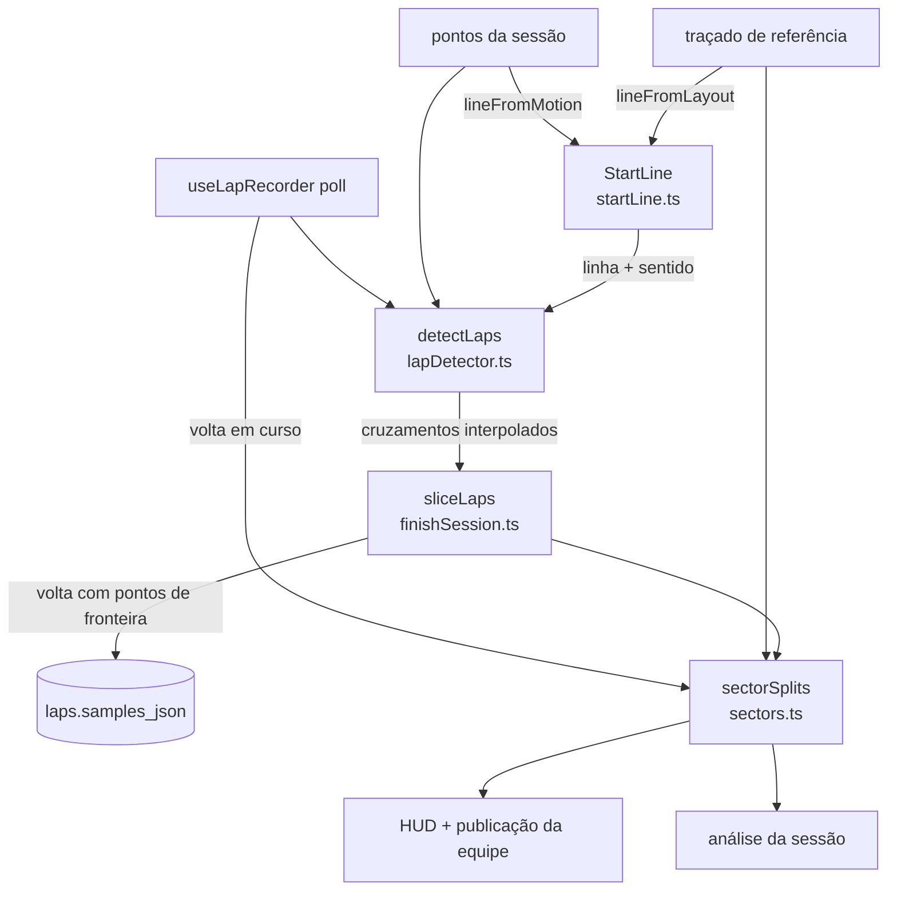

# Tempos honestos — Design

**Spec**: `.specs/features/tempos-honestos/spec.md`
**Status**: Approved (27/09)

---

## Abordagem: como a volta carrega o cruzamento exato

Depois de calcular o instante exato do cruzamento, o problema é fazer **todos** os
consumidores usarem esse instante: tempo da volta, setores, delta, análise, comparação e
mapa. Hoje o `durationMs` sai do cruzamento refinado, mas os `samples` da volta são os
pontos crus de `startIdx..endIdx`. Por isso a análise mede outra coisa.

| | Abordagem | A favor | Contra |
|---|---|---|---|
| **A (recomendada)** | **Pontos de fronteira sintéticos.** A volta passa a começar e terminar num ponto interpolado *na* linha (lat/lng/velocidade interpolados, `t` = instante do cruzamento). `samples[0].t` e `samples[last].t` são os cruzamentos, e `durationMs = last.t − first.t` | Nenhuma mudança de schema. Análise, setores, comparação, mapa e delta ficam coerentes sem código novo em cada um. A volta seguinte começa exatamente onde a anterior termina | A volta ganha dois pontos que o GPS não entregou. Eles ficam marcados com `synthetic: true` para quem precisar distinguir |
| B | Colunas `cross_start_t` / `cross_end_t` na volta, e cada consumidor aplica o deslocamento | Os pontos continuam só os do GPS | Migração de schema, e cada consumidor (análise, setores, delta, mapa, IA) precisa lembrar do deslocamento. É fácil esquecer um |
| C | Só o `durationMs` exato; os pontos continuam crus | Mudança mínima | A soma de S1+S2+S3 não fecha com o tempo da volta, e o ao vivo e a análise continuam divergindo, o que viola TMP-07 |

---

## Architecture Overview



**Invariante central:** existe **uma** função de setores (`sectorSplits`) e **uma** de linha
(`resolveStartLine`). O ao vivo, o "Encerrar", a recuperação e a análise chamam as mesmas
funções sobre os mesmos pontos. A igualdade dos números sai da construção, e não de duas
implementações que precisam concordar.

---

## Code Reuse Analysis

### Existing Components to Leverage

| Component | Location | How to Use |
| --------- | -------- | ---------- |
| `makeLocalProjector` (ENU) | `src/lib/geometry.ts:75` | Projeção local para o teste de cruzamento do segmento da linha |
| `buildReferenceLap`, `matchToReference` | `src/lib/geometry.ts:124,152` | O `sectorSplits` projeta os pontos da volta no traçado |
| `matchLapToReference`, `interpolateTimeAtS` | `src/lib/analysis.ts:45,150` | Tempo em `s = L/3` e `2L/3`. Com os pontos de fronteira, `t(0)` e `t(L)` são os cruzamentos |
| `cleanSamples`, `repairDegenerateTimestamps` | `src/lib/analysis.ts:302,328` | Aplicadas em `buildLapInsight` (TMP-12) |
| Regras de validade da volta | `src/lib/lapDetector.ts:48-56` | Continuam iguais: 300 m, 25–180 s, `lineRadius` 15 m (TMP-03) |
| `sliceLaps` | `src/recording/finishSession.ts:25` | Recebe a linha e monta a volta com os pontos de fronteira |
| Gerador de pista sintética | `test/helpers/syntheticTrack.ts` | Ganha taxa (5/10 Hz), ponto de partida e duração real conhecida, para medir o erro (≤ 20 ms) |

### Integration Points

| System | Integration Method |
| ------ | ------------------ |
| Diário de gravação (feature 1) | `RecordingMeta` ganha o campo opcional `line` (lat, lng e rumo). A versão continua 1, porque o campo opcional é compatível com o que já existe. A recuperação usa a mesma linha da gravação (TMP-06) |
| Hook `useLapRecorder` | O `setLayoutReference` passa a derivar a linha do traçado. O poll chama `detectLaps(all, { line })` e `sectorSplits` sobre a volta em curso |
| `finishRecording` / recuperação | Passam `meta.line` ao `sliceLaps` |
| Tela de sessão | O S1/S2/S3 sai de `sectorSplits` contra o traçado da sessão (`getLayout(session.layoutId)`) ou, sem traçado, contra a melhor volta. O `groupThirds` 7/7/6 sai |
| Painel da equipe (web) | Nenhuma mudança: ele já exibe `s1Ms`/`s2Ms`/`s3Ms` publicados. O que muda é o valor que o app publica |

---

## Components

### StartLine
- **Purpose**: Definir a linha de chegada (ponto e rumo) e testar se um par de pontos a cruza no sentido certo.
- **Location**: `src/lib/startLine.ts` (puro)
- **Interfaces**:
  - `type StartLine = { lat: number; lng: number; headingDeg: number }`
  - `lineFromLayout(samples: GpsSample[]): StartLine | null`: o ponto é `samples[0]`, e o rumo vai de `samples[0]` ao primeiro ponto a 5 m ou mais. Com menos de 5 pontos ou comprimento zero, devolve `null` (edge case).
  - `lineFromMotion(samples, movingStartIdx): StartLine`: mesma regra a partir do ponto em que o ritmo começou (TMP-04, AC 2).
  - `crossing(a, b, line, halfWidthM = 15): { t, lat, lng, speed, f } | null`: projeta os dois pontos no referencial da linha. `u` é a distância ao longo do rumo e `v` a distância lateral. Há cruzamento quando `u_a < 0 ≤ u_b` (sentido certo, TMP-03), `|v_cruzamento| ≤ halfWidthM` e `t_b − t_a ≤ 2000` (edge case do GPS perdido). O resultado vem de `f = −u_a/(u_b − u_a)`, que interpola `t`, posição e velocidade (TMP-01, AC 1).
- **Reuses**: `makeLocalProjector`, `haversine`.

### detectLaps (reescrito por dentro, contrato estendido)
- **Location**: `src/lib/lapDetector.ts`
- **Interfaces**:
  - `detectLaps(samples, options?: DetectLapsOptions & { line?: StartLine })`
  - `DetectedLap` ganha `startCross` e `endCross` (`{ t, lat, lng, speed }`). `durationMs = round(endCross.t − startCross.t)` e `startedAt = round(startCross.t)`.
- **Regras**:
  - Sem `line`, a linha vem de `lineFromMotion`. O primeiro cruzamento é o próprio ponto de ritmo, com `f = 0`. Isso corrige a 1ª volta (TMP-02).
  - Com `line`, a linha do traçado. O trecho antes do primeiro cruzamento não é volta (TMP-05).
  - Um cruzamento só fecha volta com 300 m ou mais percorridos e duração entre 25 s e 180 s desde o cruzamento anterior. Acima de 180 s, o ponteiro avança sem registrar volta, como hoje. Cruzamentos que não fecham volta (piloto parado na linha ou jitter) são ignorados e não reiniciam a contagem (edge case).
  - A trava `justCrossed` e o raio de 15 m em volta do ponto saem. No lugar deles entra o teste de segmento com sentido.

### sliceLaps (estendido)
- **Location**: `src/recording/finishSession.ts`
- **Interface**: `sliceLaps(samples, imu, line?: StartLine)`
- **Regra**: a volta recebe `[startCross (synthetic), ...pontos com startCross.t < t < endCross.t, endCross (synthetic)]`, e a IMU é recortada por `[startCross.t, endCross.t]`.

### sectorSplits
- **Purpose**: A única régua de S1/S2/S3 (TMP-07, TMP-08, TMP-09).
- **Location**: `src/lib/sectors.ts` (puro)
- **Interfaces**:
  - `sectorSplits(lapSamples: GpsSample[], ref: ReferenceLap): { s1Ms: number | null; s2Ms: number | null; s3Ms: number | null }`
    - usa `matchLapToReference`, depois `interpolateTimeAtS` em `L/3` e `2L/3`, e o fim é o último ponto;
    - na volta em curso, o setor que ainda não foi alcançado fica `null`;
    - numa volta fechada, `s1 + s2 + s3 = durationMs` (± 1 ms de arredondamento).
  - `referenceFromLayout(samples)` e `referenceFromLap(lap)` constroem o `ReferenceLap`. Quando a volta tem pontos de fronteira, a origem é o ponto da linha.
- **Uso**:
  - **Hook:** a cada poll, `sectorSplits(pontosDaVoltaEmCurso, refDoTraçado)` alimenta `currentSectors`. No fechamento da volta, `sectorSplits(voltaFechada, ref)` alimenta `lastClosedLapSectors`, que é o que é publicado. A marcação de limite por `last.t` (`useLapRecorder.ts:634-641`) sai.
  - **Análise:** cada volta passa por `sectorSplits(lap.samples, ref)`, em que `ref` vem do traçado da sessão ou, sem traçado, da melhor volta.

### DeltaTracker (ajuste)
- **Location**: `src/lib/realtimeDelta.ts`
- **Mudança**: o `resetLap()` põe o hint no segmento 0, em vez de `undefined`. Assim o primeiro ponto da volta casa perto de `s = 0` e nunca no fim da polilinha (TMP-10).

### Pico de velocidade
- **Location**: `src/lib/speed.ts`
- **Interfaces**:
  - `peakSpeedMs(samples): number | null`: percentil 99 (nearest-rank) da velocidade dos pontos com `accuracy ≤ 10`. Sem pontos bons, devolve `null` (TMP-11, AC 4).
  - `peakSpeedMsOfLaps(laps): number | null`
- **Consumidores**: `app/(tabs)/index.tsx:75`, `app/session/[id].tsx:556,614,615` e o marcador de pico no mapa (`:1315-1322`), `src/recording/postSave.ts:142` e `src/lib/lapInsight.ts:52`. Os consumidores mostram "—" quando o valor é `null`.
- **Fica como está:** `peakSpeedInSectorMs`. Ela mede o pico num trecho (mapa de setor) e não é o "pico da volta" da spec.

### Insights
- **Location**: `src/lib/lapInsight.ts` e `app/(tabs)/insights.tsx`
- **Mudança**:
  - `buildLapInsight` aplica `cleanSamples(10)` e `repairDegenerateTimestamps` a cada volta (TMP-12, AC 1).
  - A média por curva divide só pelas voltas com tempo válido naquela curva (AC 2).
  - A tela filtra as sessões pelo `layoutId` da sessão âncora (TMP-13).

### Timestamp do GPS
- **Location**: `src/recording/locationHandler.ts`
- **Mudança**:
  - As deps ganham `clock: { trustsRaw: boolean; lastT: number }`, que o `locationTask` zera em cada gravação.
  - O primeiro fix com sub-segundo liga `trustsRaw`. A partir daí, o timestamp cru é usado mesmo quando cai em `.000` (TMP-14, AC 1).
  - Sem `trustsRaw`, o comportamento é o atual (AC 2).
  - Todo `t` emitido é `max(t, lastT + 1)` (AC 3).

---

## Data Models

```typescript
type StartLine = { lat: number; lng: number; headingDeg: number };

type CrossPoint = { t: number; lat: number; lng: number; speed: number };

type DetectedLap = {
  startIdx: number; endIdx: number;       // índices dos pontos crus em volta dos cruzamentos
  startCross: CrossPoint; endCross: CrossPoint;
  durationMs: number; startedAt: number;
};

// GpsSample ganha o campo opcional:
type GpsSample = { /* … */ synthetic?: true };

// RecordingMeta (diário) ganha o campo opcional:
type RecordingMeta = { /* … */ line?: StartLine | null };
```

As voltas continuam em `laps.samples_json`, agora com os dois pontos de fronteira. Não há
migração. As voltas antigas continuam sem fronteira, e a análise delas se comporta como hoje
(Assumptions da spec).

---

## Error Handling Strategy

| Error Scenario | Handling | User Impact |
| -------------- | -------- | ----------- |
| Traçado com menos de 5 pontos ou comprimento zero | `lineFromLayout` devolve `null`, e a linha passa a ser inferida | Sessão tratada como sem traçado, sem setores ao vivo |
| Buraco de mais de 2 s justo na linha | Esse cruzamento é ignorado | A volta que passaria por ali não é contada (regra dos 180 s) |
| Volta sem ponto que alcance `L/3` ou `2L/3` | Setor `null` | O HUD mostra "—" naquele setor |
| Nenhum ponto com precisão de até 10 m | Pico `null` | "—" no lugar do pico; a IA recebe "sem dado" |
| Diário antigo sem `meta.line` | Linha inferida | Recuperação idêntica à de hoje |

---

## Risks & Concerns

| Concern | Location (file:line) | Impact | Mitigation |
| ------- | -------------------- | ------ | ---------- |
| Mudar `detectLaps` mexe na contagem de voltas do app inteiro | `src/lib/lapDetector.ts` | Uma regressão aqui quebra a gravação, o "Encerrar" e a recuperação | Os 5 casos de `test/lapDetector.test.ts` continuam valendo. Entram casos novos de precisão, sentido, passar perto sem cruzar, parar na linha e buraco. `test/finishSession` e `test/recovery` rodam sobre o detector real |
| A tela de sessão tem mais de 1300 linhas e duas chamadas de `groupThirds` | `app/session/[id].tsx:756,997,1102` | Refazer os terços pode quebrar o layout da aba Setores | A troca é só da fonte dos números (`sectorSplits`); a UI dos três cartões fica. Teste estático: `groupThirds` não existe mais e a tela importa `sectorSplits` |
| `GpsSample.synthetic` pode confundir consumidores que contam pontos (Hz efetivo, densidade no mapa) | `repairDegenerateTimestamps`, `cleanSamples` | Dois pontos a mais por volta | São 2 em ~500 e não alteram estatística. O `cleanSamples` preserva os pontos sintéticos (precisão herdada do par interpolado) |
| Os terços por distância do traçado dependem do map matching no início e no fim da volta, onde mora a ambiguidade da linha | `src/lib/analysis.ts:80-98` | `s` do primeiro ponto no fim da polilinha | Os pontos de fronteira ficam na própria origem do traçado (`s = 0`). A correção atual de ambiguidade continua, e o `DeltaTracker` recebe hint 0 (TMP-10) |
| Sessão que começa andando **sem** traçado: a linha inferida cai onde o ritmo "começou", que já era em movimento | `lineFromMotion` | Comportamento igual ao de hoje | Fica como está: a spec só exige o caso com traçado (TMP-05) |
| O web-spectator não é testado | `web-spectator/` | – | Não muda: só consome números |

---

## Tech Decisions

| Decision | Choice | Rationale |
| -------- | ------ | --------- |
| Forma da linha | Segmento perpendicular ao rumo, com 15 m para cada lado | Aprovado na spec. É independente da taxa do GPS |
| Rumo da linha | Do ponto da linha ao primeiro ponto a 5 m ou mais | Um segmento isolado oscila alguns graus; 5 m é o mesmo tipo de corda que `corners.ts` usa (±4 m) |
| Onde o cruzamento vive na volta | Pontos de fronteira sintéticos (abordagem A) | Coerência sem schema novo |
| Percentil | Nearest-rank sobre os pontos filtrados | Determinístico e sem interpolação, fácil de testar com valor exato |
| `trustsRaw` no relógio | Liga no primeiro sub-segundo e vale até o fim da gravação | O aparelho que já mostrou sub-segundo tem relógio GNSS confiável |

**Decisão de projeto (AD-006 no `STATE.md`):** a volta
salva começa e termina em pontos sintéticos na linha de chegada, e **toda** régua de tempo
(volta, setores, delta) é derivada desses pontos. Uma feature futura que mexa em volta
(sync da `conta-e-backup`, ranking da `nuvem-segura`) precisa preservar essa invariante.
